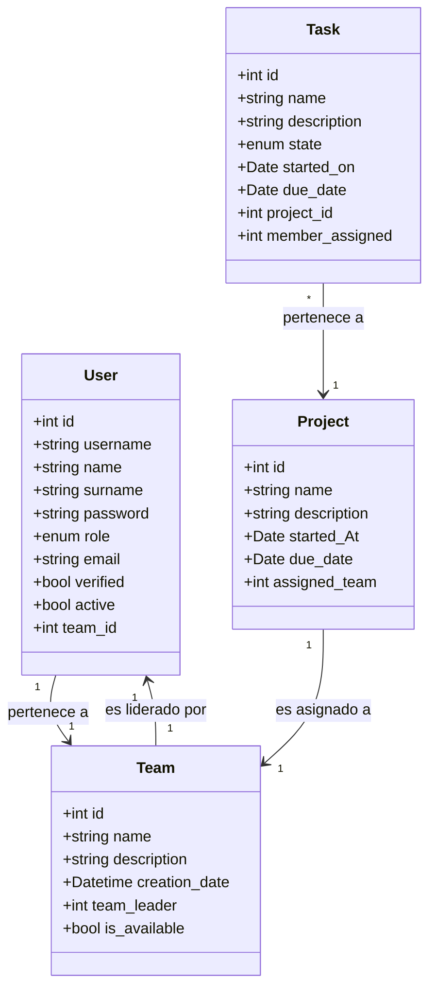

<p align="center">
  
</p>


# Pryta

Pryta es un CRUD con arquitectura MVC en PHP que simula un software de gestión de personal y proyectos. Está pensado como base educativa y como prototipo funcional para gestionar usuarios, equipos, proyectos y tareas.

## Resumen rápido

Pryta permite registrar usuarios, crear equipos, asignar proyectos a equipos y gestionar tareas con roles diferenciados: Superadmin, Teamleader y Software Engineer. Interfaz con Bootstrap 5, backend en PHP 8.2 y datos en MySQL 8.

## Características principales

  - Gestión de Usuarios: registro público, edición de perfil y administración por parte del superadmin.
  - Gestión de Equipos: creación y asignación de equipos con líderes.
  - Gestión de Proyectos: proyectos vinculados a equipos.
  - Gestión de Tareas: creación, asignación y cambio de estado de tareas.
  - Roles y permisos: Superadmin, Teamleader y Software Engineer con permisos distintos.
  - Seguridad: autenticación con sesiones, contraseñas hasheadas, validación y sanitización de entradas, uso de consultas preparadas para evitar inyección SQL y protección de archivos sensibles (por ejemplo .env) para entornos de producción.
  - Interfaz con Bootstrap 5 y lógica en PHP 8.2 sobre Apache; datos en MySQL 8.
    
## Requisitos

  PHP 8.2 con extensiones PDO o mysqli.

  MySQL 8.

  Apache (XAMPP recomendado para desarrollo).

  Navegador moderno.

## Instalación y ejecución local

1. Clonar el repositorio
````bash

git clone https://github.com/cjag99/Pryta.git
`````
2. Importar la base de datos. Para ello ejecute en su servicio de base de datos el fichero ``pryta.sql`` en la carpeta ``database``.
3. Configurar variables de entorno: Las variables de entorno en este proyecto son requeridas por un fichero ``.env.`` Deberá crearlo siguiendo la estructura proporcionada por el siguiente fichero ``.env.example``:
````env
DB_HOST="database_hostid"
DB_PORT="your_port"
DB_NAME="pryta"
DB_USERNAME="your_username"
DB_PASSWORD="your_password"
````
4. Iniciar su servidor (Apache/XAMPP/Laragon) y acceda a ``https://localhost/Pryta/``.

## Estructura del proyecto
1. Estructura de carpetas:
````
Pryta
├───index.php
├───.env
├───.env.example
├───database
├───public
│   ├───images
|   ├───validate.js
│   └───styles
└───src
    ├───Config
    ├───Controller
    ├───Model
    │   ├───Entities
    │   └───Repositories
    ├───Services
    ├───Utils
    └───Views
        ├───Auth
        ├───Dashboard
        └───Templates
````
2. Modelos y campos



## Roles y autenticación

  1. Roles: Existe un registro público que crea usuarios permisos mínimos. Dentro de la página existe un registro interno en la tabla users, que es solo accesible por usuarios con el rol más alto. Este registro permite crear usuarios con permisos superiores. Adicionalmente, cada usuario puede modificar su información personal y su contraseña de la vista ``Mi perfil``.
  2. Niveles de permisos:
     - Superadmin: Acceso completo a todalas las operaciones CRUD.
     - Team Leader: Pueder hacer SELECT en todo, e INSERT & UPDATE en la tabla ``task``.
     - Software Engineer: Puede hacer SELECT EN todo y actualizar el campo ``state`` de la tabla ``task``.

## Vistas del usuario

  - Login: Formulario básico de acceso al panel de administración.
  - Register: Registro de usuarios nuevos con permisos mínimos.
  - Home: Es la vista inicial del panel de administración. A través del menú desplegable lateral se puede acceder a las listas de las tablas.
  - List: Es la vista que crea una tabla que se rellena dinámicamente para cada tabla de la base de datos. Contiene botones que abren modales para los distintos formularios de las operaciones ``CRUD``.
  - Profile: Es la vista que muestra la información del usuario logueado, así como un pequeño formulario para actualizar su información personal.

## Implementación de seguridad:
1. Hasheado de contraseñas: Al instanciar a la entidad ``User`` se usa un ``password_hash``:
   
   ```php
    public function __construct(
        int $id,
        string $username,
        string $name,
        string $surname,
        string $passwd,
        string $role = UserRole::SOFTWARE_ENGINEER->value,
        string $email,
        bool $verified = false,
        bool $active = true,
        ?int $team_id = null
    ) {
        $this->id = $id;
        $this->username = $username;
        $this->name = $name;
        $this->surname = $surname;
        $this->passwd = password_hash($passwd, PASSWORD_DEFAULT);
        $this->role = $role;
        $this->email = $email;
        $this->verified = $verified;
        $this->active = $active;
        $this->team_id = $team_id;
    }
   ```
    Y posteriormente para verificar el login usa la función ``password_varify``:
   
    ```php
    public function verifyPassword($passwd): bool
        {
            return password_verify($passwd, $this->getPasswd());
        }
     ```
2. Escapado de caracteres HTML y sanitización: Con esto se pretende prevenir los posibles ataques XSS o ataques por inyecciones de código maliciosas. Para ello se usa el método estático ``sanitizeInput()`` de la clase ``ValidationService``:
   ```php
   public static function sanitizeInput($data){
        // Quita espacios al inicio y al final
        $data = trim($data);
        // Elimina backslashes (por si existen)
        $data = stripslashes($data);
        // Escapa caracteres especiales para salida HTML (UTF-8)
        $data = htmlspecialchars($data, ENT_QUOTES, 'UTF-8');
        return $data;
    }
   ```
3. Generación de tokens CSRF: Existe una clase entera llamada ``CSRFService`` dedicada a la generación y comprobación de tokens CSRF para evitar posibles ataques Croos-Site Request Forgery. En cada formulario del sitio se incluyen inputs tipo hidden para ir mandando dichos tokens al servidor:
   ```php
   public static function validateCSRFToken(){
        // Comprobamos que el token esté presente tanto en POST como en la sesión
        if(!isset($_POST['csrf_token'])|| !isset($_SESSION['csrf_token'])){
            return false;
        }
        // hash_equals realiza una comparación en tiempo constante (segura frente a ataques por temporización)
        return hash_equals($_SESSION['csrf_token'], $_POST['csrf_token']);
    }
   ```
4. Establecer un nº limitado de intentos de inicio de sesión: Con la clase ``AuthService`` se establecen valores inmutables de intentos de sesión y métodos que se invocan en cada intento de hacer login. Si llegas al límite se le bloquea el login al usuario durante un tiempo no superior a 15 minutos:
   ```php
   public static function checkLoginAttempts()
    {

        // Inicializamos contador y marca temporal si no existen
        if (!isset($_SESSION['login_attempts'])) {
            $_SESSION['login_attempts'] = 0;
            $_SESSION['first_attempt'] = time();
        }

        // Si alcanzamos el número máximo de intentos, comprobamos el tiempo de bloqueo
        if ($_SESSION['login_attempts'] >= self::MAX_LOGIN_ATTEMPTS) {
            $time_passed = time() - $_SESSION['first_attempt'];
            if ($time_passed < self::LOCKOUT_TIME) {
                // Calculamos minutos restantes y devolvemos el estado bloqueado
                $blocked_time = ceil((self::LOCKOUT_TIME - $time_passed) / 60);
                return [
                    'blocked' => true,
                    'message' => "Demasiados intentos. Espere {$blocked_time} minutos e inténtelo de nuevo",
                    'blocked_time' => $blocked_time
                ];
            } else {
                // Se ha cumplido el periodo de bloqueo: reseteamos para permitir nuevos intentos
                self::resetLoginAttempts();
            }
        }

        // No bloqueado: devolvemos valores por defecto
        return [
            'blocked' => false,
            'message' => "",
            'blocked_time' => 0
        ];
    ``` 
## Flujo del servidor
El flujo del sitio está totalmente definido por 3 elementos:
- index.php: Es el enrutador, el que establece los 2 controladores y el que indica que acciones pueden y deben hacer cada uno de ellos. También es aquí donde empieza la sesión
- AuthController: Se encarga de tareas relacionadas con el registro  de usuarios e inicio de sesión. También muestra la vista de ``Profile``.
- DashboardController: Es el que realiza las operaciones ``CRUD``.

  ```mermaid
  flowchart TD
    A[Index.php] --> B[AuthController]
    B -->|Credenciales válidas| A
    B -->|Credenciales inválidas| F[Mensaje de error]

  A --> C[DashboardController]
    F-->B
    B-->A 

    C --> D[Crear / Editar / Borrar / Leer]
    D --> C

    C --> A
  ```

