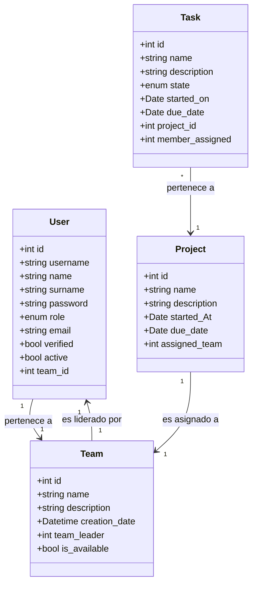

<p align="center">
  
</p>


# Pryta

Pryta es un CRUD con arquitectura MVC en PHP que simula un software de gestión de personal y proyectos. Está pensado como base educativa y como prototipo funcional para gestionar usuarios, equipos, proyectos y tareas.

## Resumen rápido

Pryta permite registrar usuarios, crear equipos, asignar proyectos a equipos y gestionar tareas con roles diferenciados: Superadmin, Teamleader y Software Engineer. Interfaz con Bootstrap 5, backend en PHP 8.2 y datos en MySQL 8.

## Características principales

  - Gestión de Usuarios: registro público, edición de perfil y administración por parte del superadmin.
  - Gestión de Equipos: creación y asignación de equipos con líderes.
  - Gestión de Proyectos: proyectos vinculados a equipos.
  - Gestión de Tareas: creación, asignación y cambio de estado de tareas.
  - Roles y permisos: Superadmin, Teamleader y Software Engineer con permisos distintos.
  - Seguridad: autenticación con sesiones, contraseñas hasheadas, validación y sanitización de entradas, uso de consultas preparadas para evitar inyección SQL y protección de archivos sensibles (por ejemplo .env) para entornos de producción.
  - Interfaz con Bootstrap 5 y lógica en PHP 8.2 sobre Apache; datos en MySQL 8.
    
## Requisitos

  PHP 8.2 con extensiones PDO o mysqli.

  MySQL 8.

  Apache (XAMPP recomendado para desarrollo).

  Navegador moderno.

## Instalación y ejecución local

1. Clonar el repositorio
````bash

git clone https://github.com/cjag99/Pryta.git
`````
2. Importar la base de datos. Para ello ejecute en su servicio de base de datos el fichero ``pryta.sql`` en la carpeta ``database``.
3. Configurar variables de entorno: Las variables de entorno en este proyecto son requeridas por un fichero ``.env.`` Deberá crearlo siguiendo la estructura proporcionada por el siguiente fichero ``.env.example``:
````env
DB_HOST="database_hostid"
DB_PORT="your_port"
DB_NAME="pryta"
DB_USERNAME="your_username"
DB_PASSWORD="your_password"
````
4. Iniciar su servidor (Apache/XAMPP/Laragon) y acceda a ``https://localhost/Pryta/``.

## Estructura del proyecto
1. Estructura de carpetas:
````
Pryta
├───index.php
├───.env
├───.env.example
├───database
├───public
│   ├───images
|   ├───validate.js
│   └───styles
└───src
    ├───Config
    ├───Controller
    ├───Model
    │   ├───Entities
    │   └───Repositories
    ├───Services
    ├───Utils
    └───Views
        ├───Auth
        ├───Dashboard
        └───Templates
````
2. Modelos y campos



Roles y autenticación

    Registro público con permisos mínimos.

    Registro interno disponible en la interfaz pero solo accesible por el admin para crear usuarios con permisos superiores.

    Edición de perfil: cada usuario puede modificar su propia información en "Mi perfil".

    Permisos:

        Superadmin: acceso completo a todas las operaciones CRUD.

        Teamleader: puede añadir y modificar tareas.

        Software Engineer: puede modificar el estado de las tareas.

        Lectura: todos los roles pueden realizar SELECT en todas las tablas.

Uso básico

    Registro: crear cuenta pública o que el admin cree usuarios con roles superiores.

    Login: acceder al panel según rol.

    Superadmin: gestionar usuarios, equipos, proyectos y tareas.

    Teamleader: crear y editar tareas, asignar miembros.

    Software Engineer: actualizar estado de tareas.

    Mi perfil: editar datos personales y cambiar contraseña.

Seguridad recomendada

    Hashear contraseñas con password_hash y verificar con password_verify.

    Usar consultas preparadas para evitar inyección SQL.

    Sanitizar y validar todas las entradas del usuario.

    Proteger archivos sensibles y no exponer .env en producción.

    Configurar HTTPS en entornos de producción.

Tests

No hay tests automatizados incluidos actualmente. Se recomienda añadir PHPUnit para pruebas unitarias y de integración.
Buenas prácticas sugeridas

    Implementar middleware de autorización para centralizar permisos.

    Añadir paginación y filtros en listados grandes.

    Crear seeders para datos de ejemplo reproducibles.

    Añadir registro de auditoría para cambios críticos.

    Implementar API REST si se requiere integración externa.

Roadmap

    Añadir tests automatizados con PHPUnit.

    Mejorar sistema de permisos con middleware.

    Implementar notificaciones por email para asignaciones y cambios de estado.

    Añadir paginación, búsqueda y filtros avanzados.

    Crear una API REST y documentación OpenAPI.

Contribuciones

    Abrir un issue describiendo el bug o la mejora.

    Crear una branch con prefijo feature/ o fix/.

    Hacer pull request con descripción clara de los cambios.

    Mantener estilo de código y documentar cambios en la base de datos.

Licencia

Añade aquí la licencia del proyecto (por ejemplo MIT o GPL-3.0). Si no hay licencia, considera añadir una para aclarar el uso y contribución.
Badges recomendados

    Build (CI)

    Coverage (cuando haya tests)

    License
