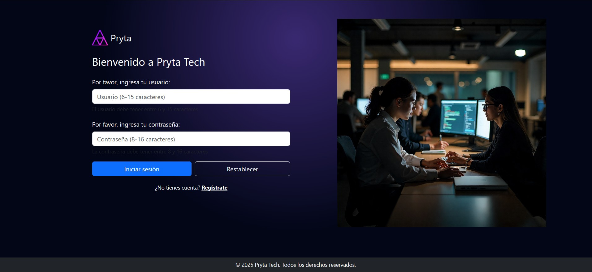
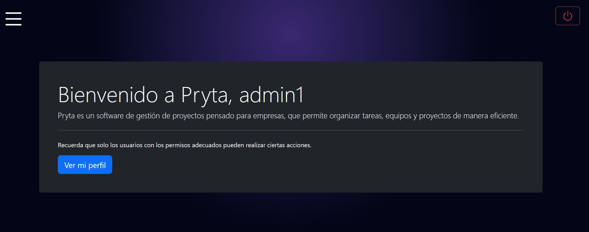

<p align="center">
  
</p>


# Pryta

[](https://www.php.net/) 
[](https://dev.mysql.com/) 
[](LICENSE)

**Pryta** es una aplicación web desarrollada en **PHP** siguiendo el patrón de arquitectura **MVC**.  
Actualmente implementa un **sistema de autenticación de usuarios** con funcionalidades de **login y registro**, sirviendo como base para una aplicación más grande.

El objetivo del proyecto es:

- Practicar y afianzar el uso de la arquitectura **MVC en PHP**
- Aprender y aplicar conceptos de **autenticación y gestión de usuarios**
- Construir una **base reutilizable** para futuros proyectos
- Servir como **proyecto académico**

---

## Tecnologías utilizadas

- **PHP 8.2**
- **MySQL 8**
- **Apache**
- **XAMPP** (entorno de desarrollo)
- **JavaScript** (validación de formularios)
- **HTML / CSS** (frontend básico)

---

## Estructura del proyecto

```text
Pryta/
│
├── src/
│   ├── Config/
│   ├── Controller/
│   ├── Model/
│   │   ├── Entities/
│   │   └── Repositories/
│   ├── Services/
│   └── Views/
│       ├── Auth/
│       └── Dashboard/
│
├── public/
│   ├── images/
│   ├── styles/
│   │   └── style.css
│   └── validate.js
│
├── database/
│   └── pryta.sql
│
├── index.php
└── README.md
```
---

## Funcionalidades

Actualmente, **Pryta** incluye:

- **Registro de usuarios** con contraseña hasheada  
- **Login de usuarios** con verificación de credenciales  
- **Gestión de sesiones** (inicio y cierre de sesión)  
- **Validación de formularios** en el frontend y backend  
- **Protección contra intentos fallidos de acceso** (control de login attempts)  

---

## Imágenes

<table>
  <tr>
    <td align="center">
      <br>
      login.php
    </td>
    <td align="center">
      <br>
      home.php
    </td>
    <td align="center">
      <br>
      register.php
    </td>
  </tr>
</table>

---

## Seguridad

**Pryta** implementa medidas de seguridad fundamentales:

- **Contraseñas hasheadas**: todas las contraseñas se almacenan utilizando `password_hash()` de PHP.  
- **Control de intentos fallidos**: previene ataques de fuerza bruta registrando intentos de login fallidos.  
- **Validación y sanitización de inputs**: tanto en frontend como en backend, evitando **SQL Injection** y datos maliciosos.

---

## Instalación y uso

1. Instala **XAMPP** o un entorno similar con **PHP 8.2**, **MySQL 8** y **Apache**.  
2. Copia la carpeta del proyecto en el directorio `htdocs` de XAMPP.
3. Este proyecto utiliza **variables de entorno** para su configuración, definidas en un archivo `.env`.
   Después de clonar el repositorio, es necesario crear el archivo `.env` en la raíz del proyecto. Puedes hacerlo tomando como referencia el archivo de ejemplo `.env.example`:
   ```env
   DB_HOST="your_database_hostid"
   DB_PORT="your_port"
   DB_NAME="pryta"
   DB_USERNAME="your_username"
   DB_PASSWORD="your_password"
   ```
5. Importa el script SQL ubicado en `database/pryta.sql`. Este script:
   - Crea la base de datos `pryta`
   - Crea las tablas necesarias
   - Inserta dos usuarios de ejemplo  
6. No es necesario configurar credenciales adicionales en `Database.php`.  
7. Abre el navegador y navega a:
```text

http://localhost/Pryta/index.php

```
6. Utiliza los usuarios de ejemplo o registra nuevos usuarios para probar la aplicación.
